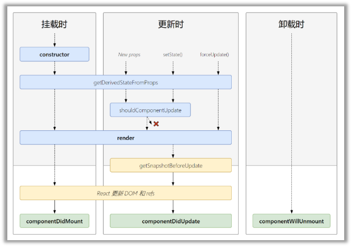

# React 组件化开发

React 是一个用于构建用户界面（UI）的 JavaScript 库，用户界面由按钮、文本和图像等小单元内容构建而成。React 帮助你把它们组合成可重用、可嵌套的 组件。

## 组件定义

**React 组件是一段可以 使用标签进行扩展 的 JavaScript 函数。**

React 组件可以通过两种形式定义，一种是函数式组件，另一种是类式组件。函数式组件通常用于无状态组件，而类式组件则可以包含状态和生命周期方法。

自从 React 16.8 版本引入 Hook 机制后，允许函数组件使用 state 和其他 React 特性，无需使用类。Hooks 让函数组件能够拥有更多的功能和灵活性，同时也简化了组件的编写。

### 定义一个组件

定义函数

```js
function Profile() {}
```

添加标签

```js
function Profile() {
  return 
}
```

导出组件

```js
function Profile() {
  return 
}

export default Profile
```

### 使用组件

```js
import Profile from './Profile'

export default function Gallery() {
  return (
    <section>
      <h1>了不起的科学家</h1>
      <Profile />
    </section>
  )
}
```

### 避坑指南

**1.组件的名称必须以大写字母开头。**

React 组件是常规的 JavaScript 函数，名称定义为小写并以小写方式引入时，React 将认为是普通的 html 标签，可能会导致渲染错误或其他问题。

```js
// Bad
function profile() {
  return 
}

export default function Gallery() {
  return (
    <section>
      <h1>了不起的科学家</h1>
      {/* React 将 profile 识别为普通的 html 标签 */}
      {/* 可能会导致渲染错误或其他问题 */}
      <profile />
    </section>
  )
}
```

```js
// Good
function Profile() {
  return 
}

export default function Gallery() {
  return (
    <section>
      <h1>了不起的科学家</h1>
      <Profile />
    </section>
  )
}
```

**2.不要在组件里嵌套定义组件。**

原因如下：

- 影响性能，导致不必要的重新渲染。父组件每次更新都会导致子组件重新挂载。
- 可维护性低、不利于代码的组织、不利于代码复用、不利于测试。

原因分析参考[真的不可以在 React 组件内部嵌套定义子组件吗？](https://prinsss.github.io/react-unstable-nested-components/)

错误示例：

```js
// Bad
export default function Gallery() {
  // 永远不要在组件中定义组件
  function Profile() {
    // ...
  }
  // ...
}
```

在顶层声明组件：

```js
// Good

// 永远不要在组件中定义组件
function Profile() {
  // ...
}

export default function Gallery() {
  // ...
}
```

使用渲染函数：

```js
// Good

export default function Gallery() {
  const renderProfile = () => {
    // ...
  }

  // ...
}
```

## JSX 语法

JSX（JavaScript XML）是一种 JavaScript 语言的语法扩展，主要用于描述用户界面。它允许开发人员以一种类似于 HTML 的标记语言风格来编写代码，这使得编写和阅读代码变得更加直观和易于理解。JSX 本质上是 React.createElement 方法的语法糖，它提供了一种更简洁的方式来描述 React 元素。

使用 JSX 来创建一个简单的 React 元素：

```js
const element = <h1>Hello, world!</h1>
```

这段代码等同于使用 React.createElement 方法创建一个'h1'类型的元素，并设置其内容为'Hello, world!'：

```js
const element = React.createElement('h1', null, 'Hello, world!')
```

### JSX 语法规则

**1.只能返回一个根元素**

JSX 虽然看起来很像 HTML，但在底层其实被转化为了 JavaScript 对象，

```tsx
export default function Component() {
  return (
    <div>
      <h1>标题</h1>
      <p>这是一段描述</p>
    </div>
  )
}
```

```tsx
export default function Component() {
  return (
    <>
      <h1>标题</h1>
      <p>这是一段描述</p>
    </>
  )
}
```

```tsx
import { Fragment } from 'react'

export default function Component() {
  return (
    <Fragment>
      <h1>标题</h1>
      <p>这是一段描述</p>
    </Fragment>
  )
}
```

**2.标签必须闭合**

JSX 语法要求所有的组件标签都必须闭合。这是因为 React 组件被视为不可分割的整体，即使在某个组件中没有内容，也需要使用自闭合的形式来表示。这一规则适用于所有的自定义组件和内置组件。

这个规则确保了 React 可以准确地追踪哪些组件正在使用中，从而有效地管理组件的生命周期。不遵守这个规则可能会导致 React 无法正确地处理组件，进而引发错误。

```tsx
<>
  
  <ul>
    <li>发明一种新式交通信号灯</li>
    <li>排练一个电影场景</li>
    <li>改进频谱技术</li>
  </ul>
</>
```

标签不闭合产生的影响：

1.对于 html 标签，React 将无法正确地解析和渲染这些元素。React 会抛出一个错误，提示存在一个未闭合的标签。

```tsx
// Bad
<div>
  <p>
</div>
```

```tsx
// Good
<div>
  <p></p>
</div>
```

2.对于自闭合的 HTML 元素，如<input>、等，React 将无法正确地解析和渲染这些元素。React 会抛出一个错误，提示存在一个未闭合的标签。

```tsx
// Bad

```

```tsx
// Good

```

3.对于自定义组件，如果标签未闭合，React 将无法正确地实例化和渲染这些组件。React 会抛出一个错误 Unterminated regexp literal。

```tsx
// Bad
export default function Gallery() {
  return (
    <section>
      <h1>了不起的科学家</h1>
      <Profile>
    </section>
  )
}
```

```tsx
// Good
export default function Gallery() {
  return (
    <section>
      <h1>了不起的科学家</h1>
      <Profile />
    </section>
  )
}
```

**3.使用驼峰式命名大部分属性命名（不是所有）**

因为 JSX 最终会被转化为 JavaScript。JavaScript 对变量的命名有限制，变量名称不能包含 - 符号或者像 class 这样的保留字。所以在 React 中，大部分 HTML 和 SVG 属性都用驼峰式命名法表示。

```tsx

```

由于历史原因，JSX 中 aria-_ 和 data-_ 属性是以带 - 符号的 HTML 格式书写。

**4.大括号使用 JavaScript**

用作标签属性

```tsx
export default function Avatar() {
  const avatar = 'https://i.imgur.com/7vQD0fPs.jpg'
  const description = 'Gregorio Y. Zara'
  return 
}
```

用作标签内文本

```tsx
export default function TodoList() {
  const name = 'Gregorio Y. Zara'
  return <h1>{name}'s To Do List</h1>
}
```

用作 CSS 对象

```tsx
export default function TodoList() {
  return (
    <ul
      style={{
        backgroundColor: 'black',
        color: 'pink',
      }}
    >
      <li>Improve the videophone</li>
      <li>Prepare aeronautics lectures</li>
      <li>Work on the alcohol-fuelled engine</li>
    </ul>
  )
}
```

### 条件渲染

在 React 中，可以通过使用 JavaScript 的 if 语句、&& 和 ? : 运算符来选择性地渲染 JSX。

**使用 if**

```jsx
function Item({ name, isPacked }) {
  if (isPacked) {
    return <li className="item">{name} ✔</li>
  }
  return <li className="item">{name}</li>
}

export default function PackingList() {
  return (
    <section>
      <h1>Sally Ride 的行李清单</h1>
      <ul>
        <Item isPacked={true} name="宇航服" />
        <Item isPacked={true} name="带金箔的头盔" />
        <Item isPacked={false} name="Tam 的照片" />
      </ul>
    </section>
  )
}
```

**使用 ? : 运算符**

```jsx
function Item({ name, isPacked }) {
  return isPacked ? (
    <li className="item">{name} ✔</li>
  ) : (
    <li className="item">{name}</li>
  )
}

export default function PackingList() {
  return (
    <section>
      <h1>Sally Ride 的行李清单</h1>
      <ul>
        <Item isPacked={true} name="宇航服" />
        <Item isPacked={true} name="带金箔的头盔" />
        <Item isPacked={false} name="Tam 的照片" />
      </ul>
    </section>
  )
}
```

**使用 ? : 运算符**

```jsx
function Item({ name, isPacked }) {
  return isPacked ? (
    <li className="item">{name} ✔</li>
  ) : (
    <li className="item">{name}</li>
  )
}

export default function PackingList() {
  return (
    <section>
      <h1>Sally Ride 的行李清单</h1>
      <ul>
        <Item isPacked={true} name="宇航服" />
        <Item isPacked={true} name="带金箔的头盔" />
        <Item isPacked={false} name="Tam 的照片" />
      </ul>
    </section>
  )
}
```

**使用 && 运算符**

```jsx
function Item({ name, isPacked }) {
  return isPacked && <li className="item">{name}</li>
}

export default function PackingList() {
  const isPacked = true

  return (
    <section>
      <h1>Sally Ride 的行李清单</h1>
      <ul>
        <Item isPacked={true} name="宇航服" />
        <Item isPacked={true} name="带金箔的头盔" />
        <Item isPacked={false} name="Tam 的照片" />
      </ul>
    </section>
  )
}
```

### 列表渲染

渲染列表数据：

```jsx
function List() {
  return (
    <ul>
      <li>凯瑟琳·约翰逊: 数学家</li>
      <li>马里奥·莫利纳: 化学家</li>
      <li>穆罕默德·阿卜杜勒·萨拉姆: 物理学家</li>
      <li>珀西·莱温·朱利亚: 化学家</li>
      <li>苏布拉马尼扬·钱德拉塞卡: 天体物理学家</li>
    </ul>
  )
}
```

从数组中渲染数据：

```jsx
function List() {
  const people = [
    '凯瑟琳·约翰逊: 数学家',
    '马里奥·莫利纳: 化学家',
    '穆罕默德·阿卜杜勒·萨拉姆: 物理学家',
    '珀西·莱温·朱利亚: 化学家',
    '苏布拉马尼扬·钱德拉塞卡: 天体物理学家',
  ]

  return (
    <ul>
      {people.map((person) => (
        <li key={person}>{person}</li>
      ))}
    </ul>
  )
}
```

数组过滤后再渲染数据，原因如下：

1. 性能问题：如果在每次渲染时都对数组进行过滤，那么即使数组本身并没有变化，也会触发不必要的渲染。
2. 可读性和可维护性：在渲染方法中添加过滤逻辑会使代码变得难以阅读和维护。过滤逻辑应该与渲染逻辑分离，这样可以让代码更加清晰和模块化。

```jsx
const people = [
  {
    id: 0,
    name: '凯瑟琳·约翰逊',
    profession: '数学家',
    accomplishment: '太空飞行相关数值的核算',
    imageId: 'MK3eW3A',
  },
  {
    id: 1,
    name: '马里奥·莫利纳',
    profession: '化学家',
    accomplishment: '北极臭氧空洞的发现',
    imageId: 'mynHUSa',
  },
  {
    id: 2,
    name: '穆罕默德·阿卜杜勒·萨拉姆',
    profession: '物理学家',
    accomplishment: '关于基本粒子间弱相互作用和电磁相互作用的统一理论',
    imageId: 'bE7W1ji',
  },
  {
    id: 3,
    name: '珀西·莱温·朱利亚',
    profession: '化学家',
    accomplishment: '开创性的可的松药物、类固醇和避孕药的研究',
    imageId: 'IOjWm71',
  },
  {
    id: 4,
    name: '苏布拉马尼扬·钱德拉塞卡',
    profession: '天体物理学家',
    accomplishment: '白矮星质量计算',
    imageId: 'lrWQx8l',
  },
]

function List() {
  const chemists = people.filter((person) => person.profession === '化学家')
  const listItems = chemists.map((person) => (
    <li>
      <span>{person.name}</span>
      <p>
        <b>{person.name}:</b>
        {' ' + person.profession + ' '}因{person.accomplishment}而闻名世界
      </p>
    </li>
  ))
  return <ul>{listItems}</ul>
}
```

#### 列表中的 KEY

**用 key 保持列表项的顺序。**这些 key 会告诉 React，每个组件对应着数组里的哪一项，所以 React 可以把它们匹配起来。这在数组项进行移动（例如排序）、插入或删除等操作时非常重要。一个合适的 key 可以帮助 React 推断发生了什么，从而得以正确地更新 DOM 树。

**key 的设定**

- 数据库的数据：表的主键，或者能充当唯一索引的值
- 本地产生的数据：自增计数器或 uuid

**key 需要满足的条件**

- key 值在兄弟节点之间必须是唯一
- key 值不能改变

**注意事项**

- 列表渲染时一定要指定唯一 key。没有显式地指定 key 值，React 默认会把数组项的索引当作 key 值来用。涉及数组操作如插入、删除等改变数组顺序的操作时，会导致数据渲染错乱。
- 不能使用运行过程中动态地产生 key，如 key={Math.random()}。这会导致每次重新渲染后的 key 值都不一样，从而使得所有的组件和 DOM 元素每次都要重新创建。
- 组件不会把 key 当作 props 的一部分。

## 组件属性（Props）

React 组件使用 props 来互相通信。每个父组件都可以提供 props 给它的子组件，从而将一些信息传递给它。props 可以是任何 JavaScript 值，包括对象、数组和函数。

属性传递：

```tsx
export default function Profile() {
  const person = {
    name: 'Lin Lanying',
    imageUrl: 'https://i.imgur.com/yXOvdOSs.jpg',
  }

  return (
    <>
      <Avatar person={person} size={100} />
    </>
  )
}
```

属性接收：

```tsx
interface AvatarProps {
  person: {
    name: string
    imageUrl: string
  }
  size: number
}

function Avatar({ person, size }: AvatarProps) {
  return (
    
  )
}
```

指定默认值：

```tsx
function Avatar({ person, size = 80 }: AvatarProps) {
  return (
    
  )
}
```

JSX 传递子组件：

```tsx
import Avatar from './Avatar'

function Card({ children }) {
  return <div className="card">{children}</div>
}

export default function Profile() {
  return (
    <Card>
      <Avatar
        size={100}
        person={{
          name: 'Katsuko Saruhashi',
          imageUrl: 'YfeOqp2',
        }}
      />
    </Card>
  )
}
```

## 组件状态（State）

在 React 中，组件的状态（State）是用来存储组件内部数据的，它代表了组件的当前状态，并且是组件渲染时的数据依据。组件的状态是动态的，会随着程序的运行而改变。

使用示例：

```jsx
// 在类组件中
class Counter extends React.Component {
  constructor(props) {
    super(props)
    this.state = {
      count: 0,
    }
  }

  handleIncrement = () => {
    this.setState({ count: this.state.count + 1 })
  }

  handleDecrement = () => {
    this.setState({ count: this.state.count - 1 })
  }

  render() {
    return (
      <div>
        <p>Clicked: {this.state.count} times</p>
        <button onClick={this.handleDecrement}>-</button>
        <button onClick={this.handleIncrement}>+</button>
      </div>
    )
  }
}
```

```jsx
// 在函数组件中
function Counter() {
  // 使用useState Hook来定义状态和对应的更新函数
  const [count, setCount] = useState(0) // 初始状态为0

  // 处理点击事件的函数
  const handleClick = () => {
    setCount((prevCount) => prevCount + 1) // 递增计数器
  }

  return (
    <div>
      <p>You clicked me {count} times</p>
      <button onClick={handleClick}>Click me</button>
    </div>
  )
}
```

**组件状态的作用**

组件的状态是组件渲染结果的依据，它决定了组件应该如何渲染到用户界面上。当组件的状态发生变化时，React 会重新渲染组件，并更新 DOM 以反映这些变化。

**组件状态的定义**

- 在类组件中通过 this.state 属性进行定义
- 在函数组件中使用 useState

**组件状态的改变**

- 在类组件中通过 this.setState 属性进行定义
- 在函数组件中使用 useState 返回的更新状态的函数，如示例中的 setCount 方法

**组件状态与 props 的区别**

组件的状态是组件内部的属性，它是由组件自己维护的，并且可以随时间改变。而 props 是从外部传入组件的属性，它们通常是静态的，不能被组件内部的方法修改。

**组件状态的设计原则**

在设计组件状态时，应该确保状态能够代表组件 UI 的完整状态集，并且是所有用于 UI 变化的状态的集合，不包含任何多余的状态。这意味着，状态中的每一个变量都应该直接或间接地影响组件的渲染结果。

**组件状态的判断依据**

决定一个变量是否应该作为组件的状态时，可以考虑以下几个因素：

- 该变量是否是直接从父组件通过 props 传递进来的？
- 该变量在组件的生命周期内是否保持不变？
- 该变量是否可以由已有的 props 或 state 计算得出？
- 该变量是否在组件的 render 方法中被使用？

**组件状态的优化**

为了提高性能，可以使用 React.memo 包装函数组件或者让类组件继承 React.memo 来防止不必要的重新渲染。此外，还可以实现 shouldComponentUpdate 方法来控制组件的更新逻辑。

## 组件生命周期

对于类组件，React 组件的生命周期可以分为几个不同的阶段，每个阶段都有其特定的用途和方法调用。



**1.挂载阶段（Mounting）‌**

这个阶段发生在组件实例被创建并插入到 DOM 中的时候。具体的生命周期方法调用顺序如下：

- constructor()：在组件挂载之前，会首先调用构造函数。在这里，你可以进行一些初始化设置，例如绑定事件处理器，或者将 props 传递给 state。
- static getDerivedStateFromProps()：这个方法在组件实例被创建后，调用 render()方法之前被调用。它允许基于 props 来派生 state，但请注意，在 React 17 及以上版本中，推荐使用 useEffect 钩子和 useState 钩子代替。
- render()：这是 class 组件中唯一必须实现的方法。它返回一个 React 元素，React 会将其渲染到 DOM 上。
- componentDidMount()：在组件挂载完成后立即调用，通常在这里执行 DOM 操作，如发起网络请求或设置定时器等。

**更新阶段（Updating）‌**

当组件的 props 或 state 发生变化时，组件会进入更新阶段。更新阶段的调用顺序如下：

- static getDerivedStateFromProps()：同挂载阶段一样，在组件接收到新的 props 时被调用。
- shouldComponentUpdate()：这是一个允许组件决定是否继续更新流程的方法。如果返回 false，则后续的渲染和生命周期方法都不会调用。
- render()：同挂载阶段。
- getSnapshotBeforeUpdate()：在最新的一轮渲染输出到 DOM 之前被调用，可以用来捕获一些 DOM 信息，如滚动位置等。
- componentDidUpdate()：在组件更新完成并被渲染到 DOM 后调用，通常在这里执行基于更新结果的 DOM 操作。

**卸载阶段（Unmounting）‌**

当组件从 DOM 中移除时，会进入卸载阶段，此时只会调用 componentWillUnmount()方法，通常在这里进行清理操作，如取消网络请求、清除定时器、解绑事件处理器等，以防止内存泄漏。

## 组件渲染

React 组件的渲染是将组件转化为可视化的用户界面，并通过客户端或服务器端的方式呈现给最终用户的过程。这个过程涉及将组件转换为浏览器可以理解的 HTML 标记。

在 React 中，有两种主要的渲染方式：客户端渲染和服务器端渲染。

**客户端渲染**

客户端渲染是在用户的浏览器中完成的。当你在 React 应用程序中定义一个组件时，你可以通过调用 ReactDOM.render()方法将该组件渲染到页面上。

```jsx
ReactDOM.render(<App />, document.getElementById('root'))
```

**服务器端渲染**

服务器端渲染（SSR）是在服务器上完成的，目的是为了生成一个完整的 HTML 页面，然后发送给客户端。这样做的好处是可以提升首次加载的性能，同时也有利于 SEO，因为搜索引擎可以直接抓取服务端生成的静态 HTML。

在 React 中，可以使用 ReactDOMServer.renderToString()来实现服务器端渲染。

```jsx
const html = ReactDOMServer.renderToString(<App />)
```

### 渲染流程

无论采用哪种渲染方式，React 都遵循类似的渲染流程：

1. 组件实例化：React 会根据组件的定义创建一个组件实例。
2. 组件挂载：React 会调用组件的 render 方法，并根据返回的 React 元素创建对应的 DOM 节点。
3. 更新：当组件的状态或属性发生变化时，React 会再次调用 render 方法，并更新 DOM 以反映新的状态。
4. 卸载：当组件不再需要时，React 会卸载组件，并从 DOM 中移除相关的节点。

### 注意事项

在进行 React 组件渲染时，需要注意以下几点：

- 状态管理：确保正确地管理和更新组件的状态，以避免不必要的渲染。
- 性能优化：合理使用 shouldComponentUpdate 等生命周期方法来减少不必要的渲染。
- 错误处理：妥善处理渲染过程中可能出现的错误，避免整个应用崩溃。
- 无障碍访问：确保渲染的 UI 满足无障碍访问标准，方便所有用户使用。

## 组件组合

在 React 中，组件的组合是一种重要的概念，它允许开发者通过将多个小部件组合在一起来构建复杂的用户界面。组件组合的核心思想在于，通过将简单、独立的组件组合起来，可以形成更为复杂、功能丰富的组件，从而实现代码的重用和模块化。

React 推荐使用组合而非继承来实现组件之间的代码重用。组件组合涉及到父子组件的关系，其中父组件通过 props 向子组件传递数据和调用方法，子组件则负责渲染具体的 UI。

例如，一个通用的对话框组件 CommonDialogBox 可以设计为接受任意子组件作为其内容。这个对话框组件本身不关心子组件的具体内容，它只是提供一个容器，通过 children prop 来传递子组件：

```jsx
function CommonDialogBox(props) {
  return (
    <div style={props.style} className={props.className}>
      {props.children}
    </div>
  )
}
```

这样，开发者就可以通过 JSX 嵌套的方式，将任意组件作为子组件传递给 CommonDialogBox：

```jsx
<CommonDialogBox>
  <MySpecialComponent />
</CommonDialogBox>
```

此外，React 还提供了 React.Children.map()和 React.cloneElement()这样的 API 来帮助我们在父组件中处理子组件。例如，我们可以使用 Children.map()来遍历子组件数组，并对每个子组件应用某些操作：

```jsx
const children = React.Children.map(this.props.children, (child) => {
  return React.cloneElement(child, { stage, handleClick: this.handleClick })
})
```

在实际应用中，组件组合不仅可以用来构建用户界面，还可以用来优化 React 应用的结构。通过显式地将一个或多个子组件作为 props 传递给父组件，我们可以在父组件内部检索并渲染这些子组件。这种方法不仅提高了组件之间的数据传递效率，还增加了代码的可读性和可维护性。

## 组件样式

在 React 中，组件的样式可以通过多种方式进行应用和管理。

**内联样式**

```jsx
function MyComponent() {
  return <div style={{ color: 'red', fontSize: '20px' }}>Hello, World!</div>
}
```

**CSS 样式表**

```scss
.my-class {
  color: blue;
  font-size: 20px;
}
```

```jsx
import './styles.css'

function MyComponent() {
  return <div className="my-class">Hello, World!</div>
}
```

**CSS 模块**

```css
/* styles.module.css */

.my-class {
  color: green;
  font-size: 20px;
}
```

```jsx
import styles from './styles.module.css'

function MyComponent() {
  return <div className={styles.myClass}>Hello, World!</div>
}
```

**styled-components**

```jsx
import styled from 'styled-components'

const MyStyledDiv = styled.div`
  color: yellow;
  font-size: 20px;
`

function MyComponent() {
  return <MyStyledDiv>Hello, World!</MyStyledDiv>
}
```
