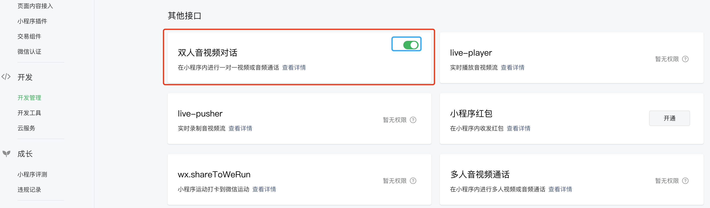
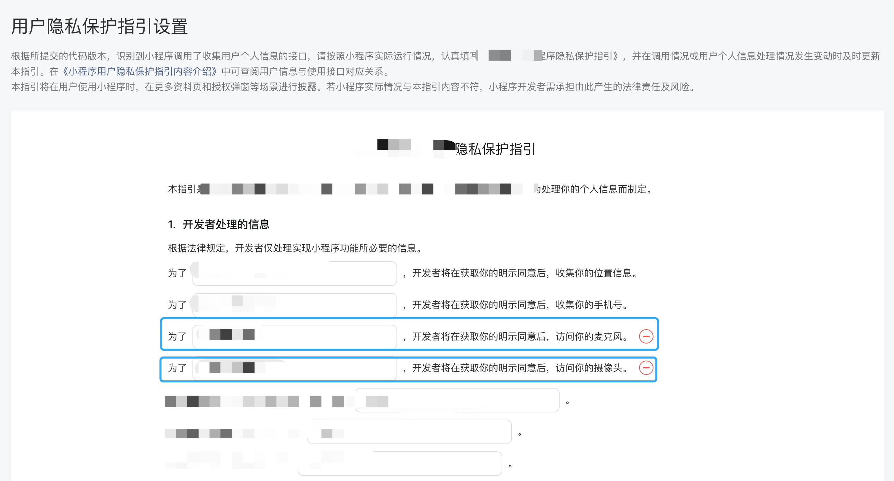

# 微信小程序实现双人音视频对话

通过双人音视频通话功能（1v1 VoIP），用户可以直接在小程序内进行一对一视频通话或音频通话。该方式仅需调用小程序 API 实现，不需要服务端介入。

微信小程序文档[双人音视频对话](https://developers.weixin.qq.com/miniprogram/dev/framework/open-ability/1v1voip.html)

## 开发前准备

**1.申请开通支持双人音视频通话的类目**


**2.开发管理接口设置中开启双人音视频对话功能**



**3.前往微信服务市场购买免费时常**

点击[微信服务市场-双人音视频通话](https://fuwu.weixin.qq.com/service/detail/00048c0090477065ad6b475ee56415)前往购买通话时长。


**4.更新小程序协议，获取用户麦克风和摄像头权限**



## 代码实现

**1.在小程序的 app.json 配置文件中声明所需的权限**

```json
{
  "pages": [],
  "window": {
    "navigationStyle": "custom"
  },
  "usingComponents": {},
  "permission": {
    "scope.record": {
      "desc": "你的描述内容，解释为何需要录音权限"
    },
    "scope.camera": {
      "desc": "你的描述内容，解释为何需要相机权限"
    }
  }
}
```

**2.询问用户授权**

唤起视频通话前需要用户授权麦克风权限和相机权限。

wx.authorize 通常与按钮组件配合使用，当用户点击按钮时，会触发授权请求。开发者需要在按钮组件上绑定相应的回调函数，并在该函数中调用 wx.authorize 方法。

```ts
wx.authorize({
  scope: 'scope.record,scope.camera',
  success() {
    // 用户已经同意授权，可以进行录音操作
    console.log('用户已授权')
  },
  fail(error) {
    // 用户拒绝授权或者授权录音异常
    console.log('scope.record.error: ', error)
  },
})
```

**3.开启双人通话功能**

微信文档参考[wx.setEnable1v1Chat](https://developers.weixin.qq.com/miniprogram/dev/api/media/voip/wx.setEnable1v1Chat.html)

```ts
// 开启一对一通话功能
wx.setEnable1v1Chat({
  enable: true, // 是否开启
  success() {
    // 开启通话功能成功
    // 可在这里调用 wx.join1v1Chat 加入（创建）双人通话
  },
  fail(error) {
    // 开启通话功能失败
    console.log('enable.error', error)
  },
})
```

**4.创建通话**

微信文档参考[wx.join1v1Chat](https://developers.weixin.qq.com/miniprogram/dev/api/media/voip/wx.join1v1Chat.html)

```ts
const { listenName, listenOpenid, callName, callOpenid } = this.data

wx.join1v1Chat({
  caller: {
    nickname: callName, // 呼出方昵称，可任意指定
    openid: callOpenid, // 呼出方openid，必须是小程序内 openid
  },
  listener: {
    nickname: listenName, // 接听方昵称，可任意指定
    openid: listenOpenid, // 接听方openid，必须是小程序内 openid
  },
  fail: function (err) {
    // 加入通话失败的回调
    wx.showToast({ icon: 'error', title: '加入通话失败' })
    console.log('join.error', err)
  },
})
```

## 完整代码示例

ts：

```ts
Page({
  data: {
    listenName: 'listener',
    listenOpenid: '',
    callName: 'caller',
    callOpenid: '',
  },

  async onLoad(query: Record<string, any>) {
    console.log('query: ', query)
  },

  async authorize() {
    return new Promise((resolve, reject) => {
      // 调用后会立刻弹窗询问用户是否同意授权
      // 首次授权会询问，再次授权不会弹窗
      wx.authorize({
        scope: 'scope.record,scope.camera',
        success() {
          // 用户已经同意授权，可以进行操作
          console.log('用户已授权')
          resolve(true)
        },
        fail(error) {
          // 用户拒绝授权或者授权异常
          console.log('scope.record.error: ', error)
          reject(error)
        },
      })
    })
  },

  handleChangeCallOpenid(e: WechatMiniprogram.CustomEvent) {
    const { value } = e.detail
    this.setData({ callOpenid: value })
  },

  handleChangeCallName(e: WechatMiniprogram.CustomEvent) {
    const { value } = e.detail
    this.setData({ callName: value })
  },

  handleChangeListenOpenid(e: WechatMiniprogram.CustomEvent) {
    const { value } = e.detail
    this.setData({ listenOpenid: value })
  },

  handleChangeListenName(e: WechatMiniprogram.CustomEvent) {
    const { value } = e.detail
    this.setData({ listenName: value })
  },

  async handleCall() {
    const auth = await this.authorize().catch(() =>
      wx.showToast({ icon: 'error', title: '唤起授权失败' })
    )
    if (!auth) return

    const { listenName, listenOpenid, callName, callOpenid } = this.data
    // 开启一对一通话功能
    wx.setEnable1v1Chat({
      enable: true,
      success() {
        // 加入（创建）双人通话
        wx.join1v1Chat({
          caller: {
            nickname: callName,
            openid: callOpenid,
          },
          listener: {
            nickname: listenName,
            openid: listenOpenid,
          },
          fail: function (err) {
            // 加入通话失败的回调
            wx.showToast({ icon: 'error', title: '加入通话失败' })
            console.log('join.error', err)
          },
        })
      },
      fail(error) {
        wx.showToast({ icon: 'error', title: '开启通话功能失败' })
        console.log('enable.error', error)
      },
    })
  },
})
```

wxml：

```html
<view class="wrapper">
  <view class="title">视频通话</view>
  <view class="form">
    <view class="form-item">
      <view class="label">对方openid</view>
      <input
        type="text"
        placeholder="请输入用户openid"
        value="{{listenOpenid}}"
        bindinput="handleChangeListenOpenid"
      />
    </view>
    <view class="form-item">
      <view class="label">对方昵称</view>
      <input
        type="text"
        placeholder="请输入用户昵称"
        value="{{listenName}}"
        bindinput="handleChangeListenName"
      />
    </view>
    <view class="space"></view>
    <view class="form-item">
      <view class="label">您的openid</view>
      <input
        type="text"
        placeholder="请输入用户openid"
        value="{{callOpenid}}"
        bindinput="handleChangeCallOpenid"
      />
    </view>
    <view class="form-item">
      <view class="label">您的昵称</view>
      <input
        type="text"
        placeholder="请输入用户昵称"
        value="{{callName}}"
        bindinput="handleChangeCallName"
      />
    </view>
    <button bindtap="handleCall">呼叫</button>
  </view>
</view>
```

scss：

```scss
.wrapper {
  box-sizing: border-box;
  height: 100vh;
  background-color: #f5f5f5;
  color: #333;

  > .title {
    padding: 20rpx;
    font-size: 28rpx;
    font-weight: bold;
  }

  .space {
    height: 30rpx;
  }

  .form {
    .form-item {
      display: flex;
      align-items: center;
      padding: 20rpx;
      border-bottom: 1px solid #f5f5f5;
      background-color: #fff;

      .label {
        width: 200rpx;
        font-size: 28rpx;
        color: #999;
      }

      input {
        font-size: 28rpx;
        color: #666;
      }
    }

    button {
      margin: 30rpx 20rpx;
      border: none;
      background-color: rgb(156, 225, 52);
      color: #fff;
    }
  }
}
```

json：

```json
{
  "window": {
    "safeArea": true
  },
  "navigationBarTitleText": "视频通话",
  "usingComponents": {}
}
```

## 注意事项

- setEnable1v1Chat 不支持在微信开发者工具使用，请使用真机预览或真机调试
- 只有通话双方都打开小程序才能接通
- 通话双方都要授权相机、麦克风权限，否者唤起通话失败
- 开发前准备工作不能露，缺一步都不能实现音视频通话功能
