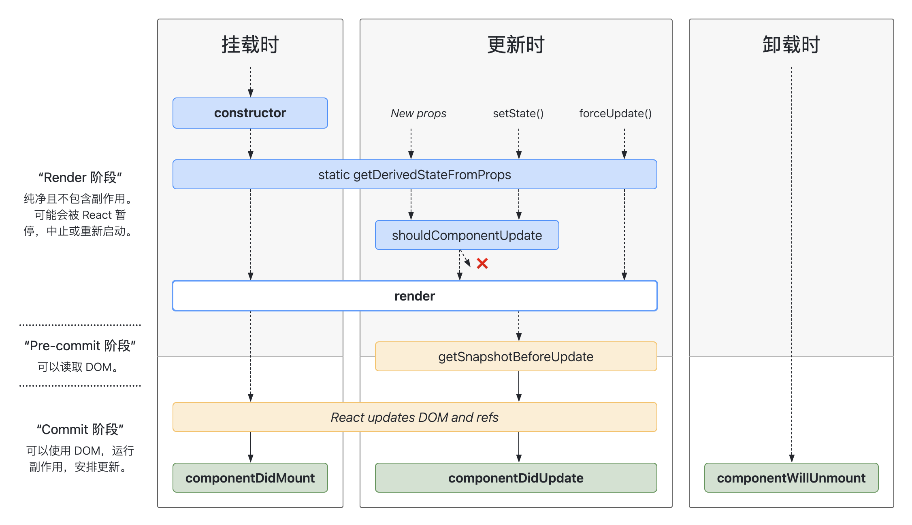

# React 组件化开发

## 一、基本概念

React 组件化开发是一种将网页或应用程序分解成多个独立、可复用的小部件的过程，这些小部件称为“组件”。

每个组件都包含了自己的逻辑和样式，使得代码更加清晰、易于管理和维护。通过这种方式，开发者可以将复杂的页面划分为一系列小问题，然后逐个解决，最终组合起来形成一个完整的应用。

## 二、组件类型

### 按定义分类

- **函数组件**由一个函数定义的，该函数接受 props 作为参数并返回一个 React 元素。
- **类组件**则是通过继承自 React.Component 的类来定义的，它们有自己的状态和生命周期方法，适用于需要复杂状态管理和事件处理的场景。

React 16.8 版本发布后，支持在函数组件中使用 hooks 定义状态。

```jsx
function Profile() {
  return 
}
```

```jsx
class Gallery extends React.Component {
  // ...code

  return (
    <section>
      <h1>了不起的科学家们</h1>
      <Profile />
      <Profile />
      <Profile />
    </section>
  );
}
```

### 按状态分类

- **无状态组件**不持有内部状态，完全依赖于 props 来接收数据。它们通常更简单、轻便，且易于测试。
- **有状态组件**拥有自己的内部状态，可以使用 this.setState 、hooks 方式来更新状态，适用于需要保持和应用逻辑相关的状态信息的场景。

```jsx
// 无状态组件
function Todo(props) {
  return <div>{props.title}</div>
}

// 有状态组件
function TodoAdd(props) {
  const [value, setValue] = useState('')
  return (
    <div>
      <input value={value} onChange={(e) => setValue(e.target.value)} />
      <button onClick={() => props.onAdd(value)}>新增</button>
    </div>
  )
}

// 有状态组件
function TodoList() {
  const [todos, setTodos] = useState([])

  const handleAdd = (value) => {
    setTodos([...todos, value])
  }

  return (
    <div>
      {todos.map((todo) => (
        <Todo key={todo} title={todo} />
      ))}
      <TodoAdd onAdd={handleAdd} />
    </div>
  )
}
```

### 按功能分类

- **展示型组件**（Presentational Component）主要关注于如何展示数据，它们通常不直接与 API 交互，而是通过 props 接收数据。
- **容器型组件**（Container Component）则负责处理和应用的业务逻辑相关的行为，例如从 API 获取数据、发起网络请求等。

```tsx
import { useState } from 'react'

function Search(props: { onSearch: (value: string) => void }) {
  const [value, setValue] = useState<string>('')

  return (
    <div>
      <input
        type="text"
        value={value}
        onChange={(e) => setValue(e.target.value)}
      />
      <button onClick={() => props.onSearch(value)}>搜索</button>
    </div>
  )
}

function Todo(props: { title: string }) {
  return <div>{props.title}</div>
}

function TodoList() {
  const [todos, setTodos] = useState<string[]>([])

  const handleSearch = async (keyword: string) => {
    // 从接口获取数据
    const data = await fetchTodoList({ keyword })
    setTodos(data)
  }

  return (
    <div>
      <Search onSearch={handleSearch} />
      {todos.map((todo) => (
        <Todo key={todo} title={todo} />
      ))}
    </div>
  )
}

export default TodoList
```

### 高阶组件

- **高阶组件**（Higher-Order Components，简称 HOC）是一种将组件抽象化的技术，它可以接受一个组件并返回一个新组价。HOC 本身不是 ReactAPI 的一部分，他们是从 react 构思本质中浮现出来的一种模式。

高阶组件常用于以下几个方面：

- 代码复用：高阶组件能够将一组通用的行为或状态管理逻辑应用于不同的组件，从而避免重复编写相同的代码。
- 逻辑抽象：通过将共通的逻辑抽象出来，高阶组件有助于保持组件的纯净性，每个组件只关注其特定的职责。
- 抽离底层准备代码：高阶组件可以用于封装那些在不同组件中共享的初始化或准备代码，使得这些逻辑可以被重用，而不是在每个组件中重复编写。
- 操纵 props：高阶组件可以在传递给被包裹组件的 props 到达之前对其进行拦截和修改，从而实现对 props 的动态控制。
- 抽取 state：高阶组件可以用于提取和管理组件间的共享状态，使得状态管理更为集中和一致。
- 访问实例：高阶组件可以访问并操作被包裹组件的实例，例如调用实例方法或访问实例属性。
- 再包装：高阶组件可以对被包裹组件进行进一步的包装，添加新的 props 或方法，甚至改变组件的结构和行为。

```tsx
import React, { useLayoutEffect, useState } from 'react'

function withScrollTracking<P extends object>(
  WrappedComponent: React.ComponentType<P>
) {
  return function ScorllTracking(props: P) {
    const [scrollY, setScrollY] = useState(0)

    useLayoutEffect(() => {
      window.addEventListener('scroll', handleScroll)

      return () => {
        window.removeEventListener('scroll', handleScroll)
      }
    }, [])

    const handleScroll = (e: Event) => {
      console.log(e)
      setScrollY(window.scrollY)
    }

    return <WrappedComponent {...props} scrollY={scrollY} />
  }
}

export default withScrollTracking
```

### 按控制分类

- **受控组件**（Controlled Component）是指其值由 React state 管理的组件，通常与表单元素一起使用，其值通过 props 传入。
- **非受控组件**（Uncontrolled Component）则不使用 React state 来管理值，而是直接读取 DOM 节点的值。

```tsx
function Search(props: { onSearch: (value: string) => void }) {
  const [value, setValue] = useState('')

  return (
    <div>
      {/* input 为受控组件 */}
      <input
        type="text"
        value={value}
        onChange={(e) => setValue(e.target.value)}
      />
      <button onClick={() => props.onSearch(value)}>搜索</button>
    </div>
  )
}
```

```tsx
function Search(props: { onSearch: (value: string) => void }) {
  const ref = useRef(null)

  const submit = () => {
    const input: HTMLInputElement = ref.current!
    props.onSearch(input.value)
  }

  return (
    <div>
      {/* input 为非受控组件 */}
      <input ref={ref} type="text" />
      <button onClick={submit}>搜索</button>
    </div>
  )
}
```

### 按托管分类

- **托管组件**指其状态完全由 React 框架本身管理的组件。这些组件的状态通常是通过 React 的 state 和 props 来控制的。当组件的状态发生变化时，React 会负责重新渲染组件以反映最新的状态。
- **非托管组件**则是其状态不由 React 框架直接管理的组件。这些组件可能会使用其他的状态管理库，如 Redux，来管理其状态。非托管组件的状态变化不会直接触发 React 的渲染机制，而是需要通过显式地调用 setState 或其他方式来通知 React 进行更新。

非托管组件示例：

```jsx
// actions.js
export const submitForm = (data) => {
  return {
    type: 'SUBMIT_FORM',
    data,
  }
}

// reducers.js
const initialState = {
  formData: {},
}

export const formReducer = (state = initialState, action) => {
  switch (action.type) {
    case 'SUBMIT_FORM':
      return {
        ...state,
        formData: action.data,
      }
    default:
      return state
  }
}

// FormComponent.jsx
import React, { useRef } from 'react'
import { useDispatch } from 'react-redux'
import { submitForm } from './actions'

const FormComponent = () => {
  const inputRef = useRef(null)
  const dispatch = useDispatch()

  const handleSubmit = (event) => {
    event.preventDefault()
    const data = {
      inputValue: inputRef.current.value,
    }
    dispatch(submitForm(data))
  }

  return (
    <form onSubmit={handleSubmit}>
      <input type="text" ref={inputRef} />
      <button type="submit">Submit</button>
    </form>
  )
}
```

## 三、组件结构

React 组件结构包含以下内容：

- 组件定义：React 组件可以用类（Class）或函数（Function）的形式来定义。
- 状态管理：类组件通过 this.state 来初始化和管理内部状态，并通过 this.setState 方法来更新状态。函数组件则可以使用 Hooks，如 useState，来添加状态管理的能力。
- 属性传递：父组件通过 JSX 标签属性的形式向子组件传递数据，子组件通过 props 参数接收这些数据。属性是只读的，子组件不应该修改接收到的 props。
- 渲染输出：无论是类组件还是函数组件，都需要返回 JSX 来描述组件的 UI 结构。JSX 是一种看起来很像 XML 的 JavaScript 语法扩展，它最终会被 Babel 转译成 React.createElement 调用。
- 事件处理：React 组件可以通过 JSX 中的事件属性来绑定事件处理函数。例如，onClick 属性可以绑定点击事件的处理函数。事件处理函数可以是类组件的方法，也可以是函数组件中的函数。

```tsx
function Search(props: { onSearch: (value: string) => void }) {
  const [value, setValue] = useState<string>('')

  return (
    <div>
      <input
        type="text"
        value={value}
        onChange={(e) => setValue(e.target.value)}
      />
      <button onClick={() => props.onSearch(value)}>搜索</button>
    </div>
  )
}
```

## 四、类组件生命周期

挂载阶段：

- constructor
- getDerivedStateFromProps
- render
- componentDidMount

更新阶段：

- getDerivedStateFromProps
- shouldComponentUpdate
- render
- getSnapshotBeforeUpdate
- componentDidUpdate

卸载阶段：

- componentWillUnMount



## 五、高阶组件

React 的高阶组件（Higher-Order Components，简称 HOC）是一种基于 React 的组合特性用于重用组件逻辑的高级技巧。HOC 本质上是一个函数，它接受一个组件作为参数并返回一个新的组件。这个过程通常涉及对原始组件的包装，以便在不改变其源代码的情况下增加额外的属性或行为。

### 工作原理

高阶组件通过以下几种方式增强组件：

- 属性代理（Props Proxy）‌：HOC 通过包装原始组件，可以操作该组件的 props，包括添加新的 props、修改现有的 props 或者过滤掉不需要的 props。
- 反向继承（Inheritance Inversion）‌：HOC 可以返回一个继承自原始组件的新组件，这样新组件就可以访问原始组件的 state 和生命周期方法。

### 使用场景

高阶组件常用于以下场景：

- 状态管理：HOC 可以为组件提供统一的状态管理逻辑，例如连接 Redux store。
- 条件渲染：根据不同的条件渲染不同的组件。
- 权限校验：根据用户的权限决定是否渲染某个组件。
- 数据获取：HOC 可以在组件挂载时获取数据，并将数据通过 props 传递给组件。

### 示例

下面是一个简单的高阶组件示例，它将一个名为 withLogging 的 HOC 应用于一个简单的组件 Welcome：

```jsx
function withLogging(WrappedComponent) {
  return class extends React.Component {
    componentDidMount() {
      console.log('Component is mounted')
    }

    componentWillUnmount() {
      console.log('Component is unmounted')
    }

    render() {
      return <WrappedComponent {...this.props} />
    }
  }
}

function Welcome(props) {
  return <h1>Hello, {props.name}</h1>
}

const LoggedWelcome = withLogging(Welcome)

// 在应用中使用增强后的组件
;<LoggedWelcome name="John" />
```

以下是一个反向继承 HOC 的示例：

```jsx
import React from 'react'

function withLogging(WrappedComponent) {
  return class extends WrappedComponent {
    componentDidMount() {
      console.log('Component is mounted')
      // 在这里可以添加任何需要在组件挂载时执行的逻辑
      super.componentDidMount()
    }

    componentWillUnmount() {
      console.log('Component is about to be unmounted')
      // 在这里可以添加任何需要在组件卸载前执行的清理逻辑
      super.componentWillUnmount()
    }

    render() {
      // 在这里可以添加任何需要在渲染阶段执行的逻辑
      return super.render()
    }
  }
}

// 假设有一个名为Welcome的组件
function Welcome(props) {
  return <h1>Hello, {props.name}</h1>
}

// 使用高阶组件增强Welcome组件
const LoggedWelcome = withLogging(Welcome)

// 在应用中使用增强后的组件
;<LoggedWelcome name="John" />
```

需要注意的是，在使用反向继承 HOC 时：

- 需要确保正确地调用父组件的方法，以避免破坏 React 组件的生命周期。
- 由于反向继承 HOC 会创建一个新的组件类，因此它不适合用于那些需要保留原始组件类的特殊用例，如使用 shouldComponentUpdate 进行性能优化的场景。

如需解决 shouldComponentUpdate 不被触发的问题，需要在 HOC 组件中显式地调用原始组件的 shouldComponentUpdate 或者使用属性代理（Props Proxy）而不是反向继承来实现 HOC。

### 注意事项

使用高阶组件时需要注意以下几点：

- 不要改变原始组件的 props，因为这可能会导致不可预见的 bug。
- 如果 HOC 改变了组件的 key，可能会影响 React 的 diff 算法，应避免这种情况。
- 不要在组件的构造函数中引用 HOC，因为构造函数可能在 HOC 之前被调用。

## 六、Render Props

Render Props 是 React 中一种特殊的模式，它允许父组件通过传递一个渲染函数作为 prop 给子组件，然后子组件在适当的时候调用这个函数并传递相应的数据，以此来决定如何在父组件中渲染这些数据。这种模式的核心在于利用了 JavaScript 的函数作为一等公民的特性，即函数可以作为数据传递。

- 使用 Render Props 的库有很多，如 React Router、Downshift、Antd 和 Formik 等。

### 工作原理

在 React 中，当一个组件接收到一个函数类型的 prop 时，它可以随时调用这个函数，并将结果插入到自己的输出中。这使得父组件能够控制子组件的渲染逻辑，而不必关心子组件内部的细节。

### 使用场景

Render Props 适用于需要跨层级的组件复用，尤其是在构建可复用的 UI 组件库时。它也适用于解决横切关注点（Cross-Cutting Concerns），即将一组相关的逻辑封装到一个组件中，并提供一个接口供外部调用。

### 示例

```jsx
function MyComponent(props) {
  return <div>{props.children(props.data)}</div>
}

function App() {
  const data = 'Hello, world!'
  return (
    <MyComponent data={data}>{(childData) => <p>{childData}</p>}</MyComponent>
  )
}
```

### 注意事项

- 将 Render Props 与 React.PureComponent 一起使用时需要小心，因为 Render Props 可能会导致性能问题。
- 使用 Render Props 时，要确保传递给子组件的函数是纯净的（pure），也就是说，这个函数不依赖于外部状态或 props，否则可能会导致不必要的重新渲染。

## 七、状态提升

在 React 中，状态提升（State Lifting）‌ 是指将多个组件需要共享的状态提升到它们共同的父组件中进行管理。

具体来说，当子组件需要某种状态来响应用户的操作或其他变化时，如果这个状态不是该子组件独有的，而是多个子组件都需要使用，那么就应该避免在每个子组件中单独维护这个状态。相反，应该把状态提升到最近的共同父组件中，父组件负责更新状态，并通过 props 将更新的状态传递给需要的子组件。这样做的好处是可以减少组件间的耦合度，使每个组件的职责更加单一，也便于管理和维护。

```jsx
import React, { useState } from 'react'

function SearchApp() {
  const [searchTerm, setSearchTerm] = useState('')
  const [searchResults, setSearchResults] = useState([])

  const handleSearchTermChange = (newSearchTerm) => {
    setSearchTerm(newSearchTerm)
    // 假设fetchSearchResults是一个异步函数，用于获取搜索结果
    fetchSearchResults(newSearchTerm).then((results) => {
      setSearchResults(results)
    })
  }

  return (
    <div>
      <SearchBar
        searchTerm={searchTerm}
        onSearchTermChange={handleSearchTermChange}
      />
      <SearchResults searchResults={searchResults} />
    </div>
  )
}

function SearchBar({ searchTerm, onSearchTermChange }) {
  return (
    <input
      type="text"
      value={searchTerm}
      onChange={(e) => onSearchTermChange(e.target.value)}
    />
  )
}

function SearchResults({ searchResults }) {
  return (
    <ul>
      {searchResults.map((result, index) => (
        <li key={index}>{result}</li>
      ))}
    </ul>
  )
}
```

## 八、Context API

React 的 Context API 是一种在组件树中传递数据的方法，它允许开发者跨多层级的组件传递数据，而无需手动在每个层级上通过 props 传递。Context API 主要解决了所谓的 "prop drilling" 问题，即当需要在深层嵌套的组件之间共享数据时，可以避免将 props 层层传递下去。

其核心思想在于创建一个特殊的组件树，这个树与显示的 UI 树并行，通过 Context API，可以在该特殊树中存储和访问数据。

### 基本概念

- Context：Context 是一个 React 对象，它包含了多个组件树层级间共享的数据。
- Provider：Provider 是一个 React 组件，它允许子组件订阅 context 的变化。通过 Provider 的 value 属性，可以将数据传递给下面的所有子组件。
- Consumer：Consumer 也是一个 React 组件，它订阅 context 的变化，并在其子函数中接收当前的 context 值。

### Context API 实现

首先，创建一个 Context 对象：

```tsx
import React from 'react'

export type Brand = {
  id: number
  name: string
}

export const BRAND_LIST: Brand[] = [
  {
    id: 1,
    name: '维达',
  },
  {
    id: 2,
    name: '蒙牛',
  },
  {
    id: 3,
    name: '伊利',
  },
]

const BrandContext = React.createContext<[Brand, (value: Brand) => void]>([
  BRAND_LIST[0],
  (value: Brand) => console.log(value),
])

export default BrandContext
```

在组件树的顶层提供一个 Context 的值：

```tsx
function BrandContainer() {
  const [brandInfo, setBrandInfo] = useState(BRAND_LIST[0])

  return (
    <BrandContext.Provider value={[brandInfo, setBrandInfo]}>
      <CurrentBrand></CurrentBrand>
      <BrandList></BrandList>
    </BrandContext.Provider>
  )
}

export default BrandContainer
```

通过 MyContext.Consumer 来访问 Context 的值：

```tsx
function CurrentBrand() {
  return (
    <BrandContext.Consumer>
      {([brand]) => `品牌名称：${brand.name}`}
    </BrandContext.Consumer>
  )
}
```

使用 useContext Hook 来访问和更新 Context 的值：

```tsx
function BrandList() {
  const [currentBrand, setBrand] = useContext(BrandContext)

  const handleSelect = (brand: Brand) => {
    if (currentBrand.id !== brand.id) {
      setBrand(brand)
    }
  }

  return BRAND_LIST.map((brand) => (
    <li key={brand.id}>
      {brand.name}
      <button onClick={() => handleSelect(brand)}>选择</button>
    </li>
  ))
}
```

### 应用场景

- **状态管理：**Context API 可以用来管理整个应用程序的状态，如用户登录状态、权限设置等。这避免了在多层组件中重复传递 props 以传递状态信息的必要性。

- **共享数据：**它可以用来在组件之间共享数据，例如应用程序的配置信息、国际化数据等。这使得这些数据可以在需要的地方被重用，而不是在每个组件中独立维护。

- **状态传播：**Context API 还可以用来在组件之间传播状态，例如应用的导航状态、页面加载状态等。这有助于保持组件之间的解耦，同时又能保证状态的一致性。

### 注意事项

- 当 Provider 的 value 发生变化时，所有消费该 context 的组件都会重新渲染。
- 如果没有匹配的 Provider，Consumer 或 useContext 将返回传递给 createContext 的 defaultValue。
- 尽量避免在 Provider 中传递大型对象或复杂数据结构，因为这可能导致不必要的重新渲染。

## 九、性能优化

### 前端通用优化

- **代码分割：**使用 Vite、 Webpack 的代码分割功能，可以将代码拆分为多个块，按需加载，减少初始加载时间。
- **懒加载：**对于不在首屏渲染的组件，可以使用懒加载技术，只有当用户滚动到该部分时才开始加载和渲染。
- **图片优化：**使用正确的文件格式（如 WebP），压缩图片大小，使用懒加载技术加载图片。
- **减少 HTTP 请求：**合并 CSS 和 JavaScript 文件，使用 CSS Sprite 合并图片。

### 减少不必要的组件更新

- **使用 React.memo：**对于函数组件，如果组件的输出只依赖于其 props，那么可以使用 React.memo 来阻止不必要的重新渲染。
- **使用 useMemo 和 useCallback：**对于计算密集型表达式或频繁更新的回调函数，可以使用 useMemo 和 useCallback 来缓存结果，避免重复计算。
- **shouldComponentUpdate：**在类组件中，可以通过重写 shouldComponentUpdate 方法来决定何时重新渲染组件。

```jsx
/**
 * props 没有发生变化时，组件不会重新渲染
 */
import React from 'react'

const MyComponent = React.memo(function MyComponent(props) {
  // 组件的渲染逻辑
  return <div>{props.name}</div>
})

export default MyComponent
```

```jsx
/**
 * props.name 没有发生变化时，组件不会重新渲染
 */
import React from 'react'

const MyComponent = React.memo(
  function MyComponent(props) {
    // 组件的渲染逻辑
    return <div>{props.name}</div>
  },
  (prevProps, nextProps) => {
    // 自定义比较逻辑
    return prevProps.name === nextProps.name
  }
)

export default MyComponent
```

```jsx
import React, { useMemo } from 'react'

function MyComponent({ a, b }) {
  const expensiveResult = useMemo(() => {
    // 这是一个计算成本较高的操作
    let result = 0
    for (let i = 0; i < 10000; i++) {
      result += i * a * b
    }
    return result
  }, [a, b]) // 依赖项列表，只有当 a 或 b 发生变化时，expensiveResult 才会重新计算

  return <div>{expensiveResult}</div>
}

export default MyComponent
```

```jsx
import React, { useCallback } from 'react'

function ParentComponent() {
  const [count, setCount] = React.useState(0)

  const increment = useCallback(() => {
    setCount(count + 1)
  }, [count]) // 依赖项列表，只有当 count 发生变化时，increment 才会更新

  return <ChildComponent increment={increment} />
}

function ChildComponent({ increment }) {
  // ...
}

export default ParentComponent
```

### 提交阶段优化

- **批量更新：**React 默认会在微任务中批量更新组件，以减少 DOM 操作的次数。但有时你可能需要显式地控制这一行为，例如在 useTransition 中。
- **使用 useDeferredValue：**当需要延迟计算或更新某个值时，可以使用 useDeferredValue。
- **使用 useChunkedEvaluation：**当渲染大量子组件时，可以使用 useChunkedEvaluation 来分批渲染以提高性能。

### 交互优化

- **使用 useEvent：**当需要响应事件时，可以使用 useEvent 来替代传统的 onEvent 属性。
- **使用 useTransition：**对于复杂的交互逻辑，可以使用 useTransition 来控制状态转换。

### 性能监控和分析：

- **使用 React DevTools：**这是一个强大的工具，可以帮助你分析和优化 React 应用的性能。

## 十、组件测试

在 React 中，组件测试是确保组件按预期工作的关键步骤。组件测试可以分为单元测试和集成测试两种类型。单元测试关注于单个组件的行为，而集成测试则关注于组件之间的交互。以下是一些常用的 React 组件测试方法：

- Jest 和 Enzyme：Jest 是一个流行的 JavaScript 测试框架，而 Enzyme 是一个 JavaScript 测试库，专门用于 React 组件的测试。Enzyme 提供了丰富的 API 来模拟组件的渲染、事件处理和节点操作。

- React Testing Library：这是一个轻量级的测试库，鼓励开发者编写声明式的测试，即专注于测试组件的行为而非内部实现细节。React Testing Library 的优点在于它与 React DevTools 配合得很好，可以帮助你写出更具可维护性的代码。

- MobX-React-Utils：如果你的应用使用了 MobX 状态管理库，那么 MobX-React-Utils 可以帮助你编写测试，模拟 MobX 的副作用和观察者。

- Cypress：虽然 Cypress 主要用于端到端的测试，但它也提供了强大的 API 来测试 React 组件。Cypress 允许你在浏览器环境中运行测试，确保组件在真实环境下的表现符合预期。

- React 快照测试：这是一种常见的单元测试方法，通过比较当前组件渲染的结果与之前保存的快照来验证组件是否发生了未预期的变化。

- React 组件渲染测试：这种测试方法关注于组件渲染出来的 HTML 结构是否符合预期。你可以使用像 jest-dom 这样的库来帮助你编写这类测试。

- React 组件事件测试：这种测试方法关注于组件的事件处理逻辑是否正确。你可以使用 Jest 和 Enzyme 来模拟用户事件，并断言组件的 props 和 state 是否按照预期发生了变化。

- React 组件状态测试：这种测试方法关注于组件的状态管理是否正确。你可以使用 Jest 和 Enzyme 来模拟组件的 state 更新，并断言组件的渲染结果是否符合预期。
