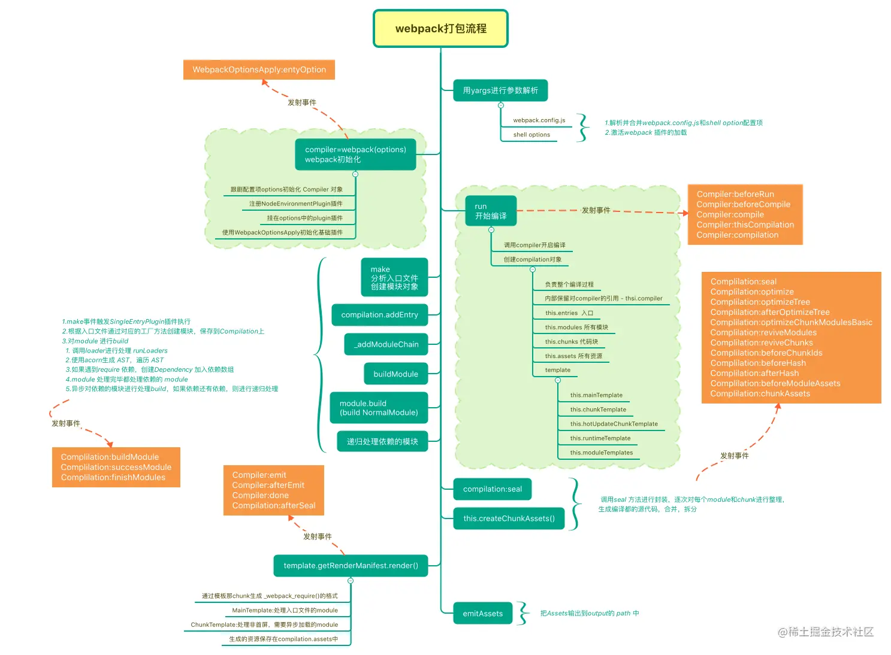

# Webpack 编译原理

webpack 打包编译过程大概分为一下几个步骤：

- **初始化**：Webpack 读取配置文件（如 webpack.config.js），初始化编译环境。
- **解析**：Webpack 从入口文件开始，递归地构建一个依赖图（dependency graph），这个图包含了应用程序需要的每一个模块以及它们之间的依赖关系。
- **转换**：Webpack 使用 Loader 对模块进行转换。Loader 可以处理不同类型的文件，如 CSS、JavaScript、图片等，将它们转换成 JavaScript 模块。
- **优化**：在转换完成后，Webpack 可以应用一系列优化措施，如代码压缩、混淆、树摇（Tree Shaking）、模块合并等，以减小最终输出文件的大小。
- **生成**：Webpack 根据依赖图生成最终的输出文件（bundle）。这些文件包含了应用程序的所有代码，可以部署到服务器上供客户端下载和执行。
- **插件执行**：在整个编译过程中，Webpack 会触发多个钩子（hooks），允许插件介入并执行特定的任务，如清理输出目录、生成 HTML 文件、提取 CSS 到单独的文件等。
  输出：最终，Webpack 将编译好的文件输出到指定的目录中，这些文件已经准备好用于生产环境。

## webpack 编译过程中的重要对象

Webpack 编译过程中的重要对象包括：

- Compiler 对象：代表整个编译过程的实例。它提供了插件系统，允许你在编译的不同阶段注入自定义逻辑。
- Compilation 对象：代表单次编译的实例。每当启动新的编译时，就会创建一个新的 Compilation 对象。它包含了当前编译的状态和数据。
- Asset 对象：代表编译过程中生成的文件。每个 Asset 对象都包含文件的内容和一些元数据，如大小、哈希值等。
- Module 对象：代表一个模块的实例。每个 Module 对象都包含了模块的代码、资源和其他相关信息。
- Chunk 对象：代表一组模块的集合。Chunk 是 Webpack 内部的概念，用于组织和管理模块的输出。
- Watcher 对象：负责监视文件系统的变更，并在文件发生变化时重新启动编译过程。
- NormalModuleFactory 对象：负责创建新的 NormalModule 实例。它是模块解析和加载过程的核心部分。
- MultiCompiler 对象：允许同时运行多个 Compiler 实例，这对于并行构建多个项目非常有用。

## Webpack 编译主要流程

编译主要流程有三步：

1.**初始化**：启动构建，读取与合并配置参数，加载 Plugin，实例化 Compiler。 2.**编译**：从 Entry 发出，针对每个 Module 串行调用对应的 Loader 去翻译文件内容，再找到该 Module 依赖的 Module，递归地进行编译处理。 3.**输出**：对编译后的 Module 组合成 Chunk，把 Chunk 转换成文件，输出到文件系统。

注：文档参考[webpack 编译流程](https://juejin.cn/post/6844903935828819981/)

### 初始化阶段

事件过程及对应的解析如下：

- **初始化参数**：从配置文件和 Shell 语句中读取与合并参数，得出最终的参数。 这个过程中还会执行配置文件中的插件实例化语句 new Plugin()。
- **实例化 Compiler**：用上一步得到的参数初始化 Compiler 实例，Compiler 负责文件监听和启动编译。Compiler 实例中包含了完整的 Webpack 配置，全局只有一个 Compiler 实例。
- **加载插件**：依次调用插件的 apply 方法，让插件可以监听后续的所有事件节点。同时给插件传入 compiler 实例的引用，以方便插件通过 compiler 调用 Webpack 提供的 API。
- **environment**：开始应用 Node.js 风格的文件系统到 compiler 对象，以方便后续的文件寻找和读取。
- **entry-option**：读取配置的 Entrys，为每个 Entry 实例化一个对应的 EntryPlugin，为后面该 Entry 的递归解析工作做准备。
- **after-plugins**：调用完所有内置的和配置的插件的 apply 方法。
- **after-resolvers**：根据配置初始化完 resolver，resolver 负责在文件系统中寻找指定路径的文件。

### 编译阶段

事件过程及对应的解析如下：

- **before-run**：清除缓存。
- **run**：启动一次新的编译。
- **watch-run**：和 run 类似，区别在于它是在监听模式下启动的编译，在这个事件中可以获取到是哪些文件发生了变化导致重新启动一次新的编译。
- **compile**：该事件是为了告诉插件一次新的编译将要启动，同时会给插件带上 compiler 对象。
- **compilation**：当 Webpack 以开发模式运行时，每当检测到文件变化，一次新的 Compilation 将被创建。一个 Compilation 对象包含了当前的模块资源、编译生成资源、变化的文件等。Compilation 对象也提供了很多事件回调供插件做扩展。
- **make**：一个新的 Compilation 创建完毕，即将从 Entry 开始读取文件，根据文件类型和配置的 Loader 对文件进行编译，编译完后再找出该文件依赖的文件，递归的编译和解析。
- **after-compile**：一次 Compilation 执行完成。这里会根据编译结果 合并出我们最终生成的文件名和文件内容。
- **invalid**：当遇到文件不存在、文件编译错误等异常时会触发该事件，该事件不会导致 Webpack 退出。

compilation 过程中的重要事件如下：

- build-module：使用对应的 Loader 去转换一个模块。
- normal-module-loader：在用 Loader 对一个模块转换完后，使用 acorn 解析转换后的内容，输出对应的抽象语法树（AST），以方便 Webpack 后面对代码的分析。
- program：从配置的入口模块开始，分析其 AST，当遇到 require 等导入其它模块语句时，便将其加入到依赖的模块列表，同时对新找出的依赖模块递归分析，最终搞清所有模块的依赖关系。
- seal：所有模块及其依赖的模块都通过 Loader 转换完成后，根据依赖关系开始生成 Chunk。

### 输出阶段

事件过程及对应的解析如下：

- **should-emit**：所有需要输出的文件已经生成好，询问插件哪些文件需要输出，哪些不需要。
- **emit**：确定好要输出哪些文件后，执行文件输出，可以在这里获取和修改输出内容。
- **after-emit**：文件输出完毕。
- **done**：成功完成一次完成的编译和输出流程。
- **failed**：如果在编译和输出流程中遇到异常导致 Webpack 退出时，就会直接跳转到本步骤，插件可以在本事件中获取到具体的错误原因。

## Webpack 给插件提供的钩子函数

Webpack 的 Compiler 和 Compilation 对象提供了多种钩子（hooks），允许插件在编译的不同阶段介入并执行自定义逻辑。以下是一些常见的钩子用法：

**Compiler 钩子**

- run：
  - 在编译开始之前触发，可以用来执行一些准备工作。
  - 例如，清除旧的输出目录，初始化日志记录等。
- compile：
  - 在每次编译开始时触发，可以用来设置编译环境。
  - 例如，根据环境变量动态配置加载器或插件。
- emit：
  - 在 Webpack 准备将文件写入磁盘之前触发，可以用来修改输出文件。
  - 例如，添加额外的文件，修改输出的文件名等。
- done：
  - 在编译结束后触发，可以用来处理编译结果。
  - 例如，根据编译结果发送通知，记录编译时间等。

**Compilation 钩子**

- addModule：
  - 在模块被添加到编译中时触发，可以用来修改模块的处理方式。
  - 例如，根据模块的类型或路径应用特定的加载器。
- optimizeChunkAssets：
  - 在优化块资源时触发，可以用来优化输出的资源。
  - 例如，合并或压缩 JavaScript 和 CSS 文件。
- processAssets：
  - 在处理资源（assets）时触发，可以用来执行资源的后处理。
  - 例如，对输出的 JavaScript 或 CSS 进行混淆或压缩。
- afterOptimizeAssets：
  - 在资源优化完成后触发，可以用来执行一些后处理任务。
  - 例如，生成额外的文件，如服务工作线程（service worker）的配置文件。

## Webpack 在编译过程中的错误处理

**错误捕获**

Webpack 在执行编译任务时，会捕获过程中发生的任何错误。这些错误可能来自 Webpack 自身的代码，也可能来自加载器（loaders）、插件（plugins）或其他用户提供的脚本。

**错误分类**

Webpack 将错误分为两类：

- 编译错误（compilation errors）：编译错误是在编译过程中发现的，如语法错误、插件错误等。
- 运行时错误（runtime errors）：运行时错误是在编译后的代码执行时发生的，如未定义的变量、类型不匹配等。

**错误报告**

Webpack 会将捕获到的错误添加到编译结果中。对于编译错误，Webpack 会将它们添加到 compilation.errors 数组中。对于运行时错误，Webpack 会在构建成功后，将错误信息输出到控制台。

**错误显示**

Webpack 会在控制台输出详细的错误信息，包括错误类型、位置、相关的源代码行和列号等。这有助于开发者快速定位和解决问题。

**编译终止**

如果遇到编译错误，Webpack 默认会终止编译过程，并不会生成输出文件。这是为了防止生成无效或不完整的构建产物。

**错误处理选项**

Webpack 提供了一些配置选项来控制错误处理的行为。例如，stats 配置项可以用来控制错误信息的显示格式和详细程度。bail 配置项可以设置为 true 来确保在遇到第一个错误时立即停止编译。

**错误恢复**
在某些情况下，开发者可能希望 Webpack 即使遇到错误也能继续编译过程，以便生成尽可能多的有效代码。这可以通过设置 bail: false 来实现，但这通常不推荐，因为它可能导致生成的代码包含错误。

**错误调试**

Webpack 提供了丰富的调试工具和插件，如 source-map-loader 和 eval-source-map，它们可以帮助开发者更好地理解和修复错误。

## Q&S

### webpack 插件执行时机以及插件与 webpack 之间是如何交互的？

// TODO
