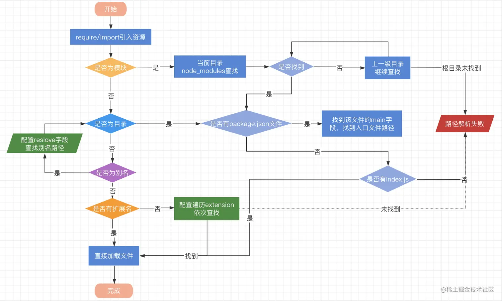

# Webpack 模块

Webpack 模块是构成 Web 应用程序的基本单元，它们可以是 JavaScript 文件、CSS 文件、图片、字体或其他任何可以通过 Webpack Loader 处理的资源。每个模块都是一个独立的文件，可以包含代码、数据或资源，并且可以与其他模块交互。

## Webpack 支持的模块

**原生支持的模块**

- ECMAScript 模块
- CommonJS 模块
- AMD 模块
- Assets
- WebAssembly 模块

**通过 loader 支持的模块**

- CoffeeScript
- TypeScript
- ESNext (Babel)
- Sass
- Less
- Stylus
- Elm
- ...(其他)

## Webpack 模块的特性

- 独立性：每个模块都是自包含的，拥有自己的作用域，避免了全局变量污染的问题。
- 可重用性：模块可以被多个地方导入和重用，提高了代码的复用性。
- 依赖性：模块可以明确地声明其依赖的其他模块，使得构建过程可以正确地解析和打包这些依赖关系。

## Webpack 模块解析

在 Webpack 中，模块解析（Module Resolution）是指 Webpack 如何找到并解析项目中引用的模块。
Webpack 使用 resolver 来确定模块的绝对路径。模块可以是应用程序代码的一部分，也可以是第三方库。

### 模块解析配置

resolve 解析配置项参考如下：

- extensions：一个字符串数组，表示在查找模块时应该尝试的文件扩展名。例如，如果你设置了 ['.js', '.jsx']，Webpack 会在没有提供扩展名的情况下尝试这些扩展名。
- alias：一个对象，用于创建模块的别名，使得模块的引入更加简单。例如，你可以为 react 设置一个别名，这样就可以直接使用 import React from 'react' 而不需要指定完整的路径。
- modules：一个字符串数组，表示在查找模块时应该搜索的目录。通常包括 node_modules 目录。
- mainFields：一个字符串数组，表示在查找模块的主要入口字段时应该检查的字段顺序。例如，如果你设置了 ['browser', 'module', 'main']，Webpack 会首先尝试查找 package.json 中的 browser 字段，然后是 module 字段，最后是 main 字段。
- descriptionFiles：一个字符串数组，表示应该考虑的描述文件。这些文件通常用于描述模块的元数据，如 package.json。
- symlinks：一个布尔值，表示是否应该解析符号链接。默认情况下，Webpack 会解析符号链接。

配置示例：

```js
module.exports = {
  // ...其他配置...
  resolve: {
    extensions: ['.js', '.jsx'],
    alias: {
      react: 'preact/compat',
    },
    modules: ['node_modules', 'src'], // 默认值为 ['node_modules']
    mainFields: ['browser', 'module', 'main'],
    descriptionFiles: ['package.json'],
    symlinks: true,
  },
  // ...其他配置...
}
```

### 模块解析规则

使用 enhanced-resolve，webpack 能解析三种文件路径：

**绝对路径**

直接读取，不需要解析

```js
import '/home/me/file'
import 'C:\\Users\\me\\file'
```

**相对路径**

当前上下文的相对路径。在 import/require 中给定的相对路径，会拼接此上下文路径，来生成模块的绝对路径。

```js
import '../src/file1'
import './file2'
```

**模块路径**

在 resolve.modules 中指定的所有目录检索模块。 也可以通过配置别名的方式来替换初始模块路径，具体请参照 resolve.alias 配置选项。

Webpack 会首先在当前目录下的文件夹中查找该模块。如果在当前目录下找不到，Webpack 会向上遍历父目录，直到找到该模块或到达项目根目录为止。

```js
import 'module'
import 'module/lib/file'
```

路径解析规则：



注：图片来源参考[地址](https://juejin.cn/post/7004267670832955423)

## 远程模块

暂时用不上，忽略